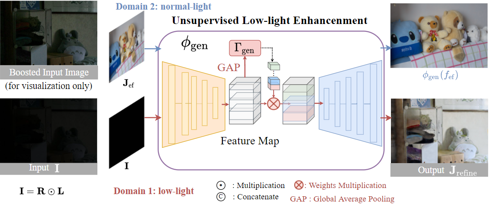
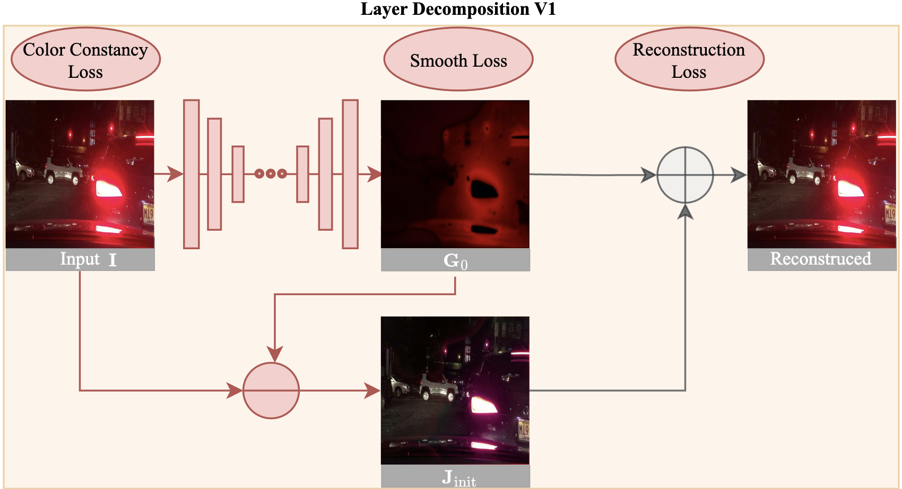
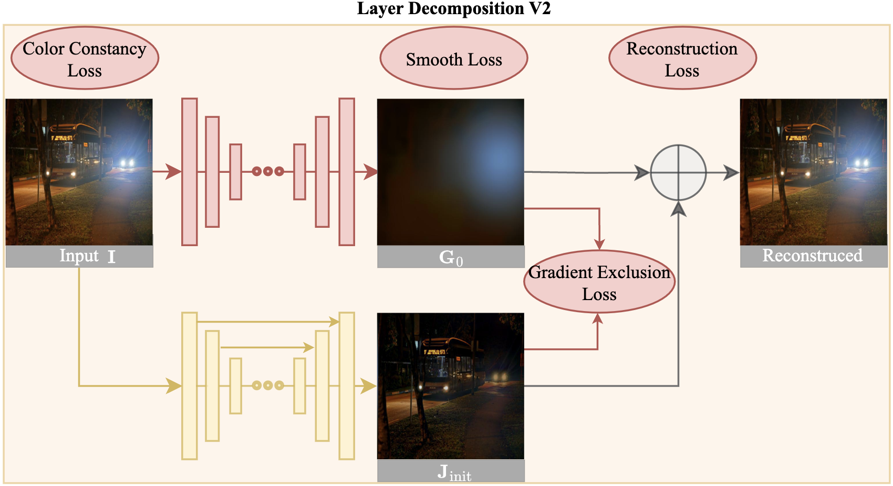

# night_enhancement (ECCV'2022)

## Introduction
This is an implementation of the following paper.
> [Unsupervised Night Image Enhancement: When Layer Decomposition Meets Light-Effects Suppression](https://arxiv.org/abs/2207.10564)\
> European Conference on Computer Vision (`ECCV'2022`)

[Yeying Jin](https://jinyeying.github.io/), [Wenhan Yang](https://flyywh.github.io/) and [Robby T. Tan](https://tanrobby.github.io/pub.html)

[[Paper]](https://www.ecva.net/papers/eccv_2022/papers_ECCV/papers/136970396.pdf)
[[Supplementary]](https://www.ecva.net/papers/eccv_2022/papers_ECCV/papers/136970396-supp.pdf)
[](https://arxiv.org/abs/2207.10564)
[[Poster]](https://github.com/jinyeying/night-enhancement/blob/main/poster_slides/0982_poster.pdf) 
[[Slides]](https://github.com/jinyeying/night-enhancement/blob/main/poster_slides/0982_slides.pdf) 
[[Link]](https://mp.weixin.qq.com/s/5wjV6R95SrQHXxqMnENAAw)

[](https://paperswithcode.com/sota/low-light-image-enhancement-on-lol?p=unsupervised-night-image-enhancement-when)
🔥[](https://replicate.com/cjwbw/night-enhancement)🔥

## Datasets
### 1. Light-Effects Suppression on Night Data
1. Light-effects data [[Dropbox]](https://www.dropbox.com/sh/ro8fs629ldebzc2/AAD_W78jDffsJhH-smJr0cNSa?dl=0) | [[BaiduPan (code:self)]](https://pan.baidu.com/s/1x6HHdi-YlO7USkNQrp23ng?pwd=self) <br>
Light-effects data is collected from Flickr and by ourselves, with multiple light colors in various scenes. <br>
* `CVPR2021`
*Nighttime Visibility Enhancement by Increasing the Dynamic Range and Suppression of Light Effects* [[Paper]](https://openaccess.thecvf.com/content/CVPR2021/papers/Sharma_Nighttime_Visibility_Enhancement_by_Increasing_the_Dynamic_Range_and_Suppression_CVPR_2021_paper.pdf)\
[Aashish Sharma](https://aasharma90.github.io/) and [Robby T. Tan](https://tanrobby.github.io/pub.html)

<p align="left">
  
</p>

2. LED data [[Dropbox]](https://www.dropbox.com/sh/7lhpnj2onb8c3dl/AAC-UF1fvJLxvCG-IuYLQ8T4a?dl=0) | [[BaiduPan (code:ledl)]](https://pan.baidu.com/s/1jVYjvLkoBLXtGZVDj2JJZA?pwd=ledl) <br>
We captured images with dimmer light as the reference images.
<p align="left">
  
</p>

3. GTA5 nighttime fog [[Dropbox]](https://www.dropbox.com/sh/gfw44ttcu5czrbg/AACr2GZWvAdwYPV0wgs7s00xa?dl=0) | [[BaiduPan (code:67ml)]](https://pan.baidu.com/s/1hW9wfVhvYbRaUdHbozOPbw?pwd=67ml) <br>
Synthetic GTA5 nighttime fog data.<br> 
* `ECCV2020`
*Nighttime Defogging Using High-Low Frequency Decomposition and Grayscale-Color Networks* [[Paper]](https://www.ecva.net/papers/eccv_2020/papers_ECCV/papers/123570460.pdf)\
Wending Yan, [Robby T. Tan](https://tanrobby.github.io/pub.html) and [Dengxin Dai](https://vas.mpi-inf.mpg.de/) 

<p align="left">
  
</p>

4. Syn-light-effects [[Dropbox]](https://www.dropbox.com/sh/2sb9na4ur7ry2gf/AAB1-DNxy4Hq6qPU-afYIKVaa?dl=0) | [[BaiduPan (code:synt)]](https://pan.baidu.com/s/1nfg2FnlBbh_QoBJM6nsY8g?pwd=synt) <br>
Synthetic-light-effects data is the implementation of the paper:<br>
* `ICCV2017`
*A New Convolution Kernel for Atmospheric Point Spread Function Applied to Computer Vision* [[Paper]](https://ieeexplore.ieee.org/document/4408899)\
Run the [Matlab code](https://github.com/jinyeying/night-enhancement/blob/main/glow_rendering_code/repro_ICCV2007_Fig5.m) to generate Syn-light-effects:
```
glow_rendering_code/repro_ICCV2007_Fig5.m
```
<p align="left">
  
</p>

### 2. Low-Light Enhancement Data
1. [LOL dataset](https://daooshee.github.io/BMVC2018website/) <br>
"Deep Retinex Decomposition for Low-Light Enhancement", BMVC, 2018. [[Baiduyun (code:sdd0)]](https://pan.baidu.com/s/1spt0kYU3OqsQSND-be4UaA) | [[Google Drive]](https://drive.google.com/file/d/18bs_mAREhLipaM2qvhxs7u7ff2VSHet2/view?usp=sharing) <br>

2. [LOL-Real dataset](https://github.com/flyywh/CVPR-2020-Semi-Low-Light/) <br>
"Sparse Gradient Regularized Deep Retinex Network for Robust Low-Light Image Enhancement", TIP, 2021. [[Baiduyun (code:l9xm)]](https://pan.baidu.com/s/1U9ePTfeLlnEbr5dtI1tm5g) | [[Google Drive]](https://drive.google.com/file/d/1dzuLCk9_gE2bFF222n3-7GVUlSVHpMYC/view?usp=sharing) <br> 

# 3. Low-Light Enhancement Results:
## Pre-trained Model
1. Download the pre-trained LOL model [[Dropbox]](https://www.dropbox.com/s/0ykpsm1d48f74ao/LOL_params_0900000.pt?dl=0) | [[BaiduPan (code:lol2)]](https://pan.baidu.com/s/10VL4ZhV13zfokmRSBTOKyg?pwd=lol2), put in `./results/LOL/model/`
2. Put the test images in `./LOL/`

## Low-light Enhancement Test 
🔥[](https://replicate.com/cjwbw/night-enhancement)🔥 Online test: https://replicate.com/cjwbw/night-enhancement
<p align="left">
  
</p>

```
python main.py
```

## Low-light Enhancement Train
There is no decomposition, light-effects guidance for low-light enhancement. 
<p align="left">
  
</p>

```
CUDA_VISIBLE_DEVICES=1 python main.py --dataset LOL --phase train --datasetpath /home1/yeying/data/LOL_Cap/
```

## Results
<p align="left">
  
</p>

1. LOL-test Results (15 test images) [[Dropbox]](https://www.dropbox.com/sh/la21ocjk14dtg9t/AABOBsCQ39Oml33fItqX5koFa?dl=0) | [[BaiduPan (code:lol1)]](https://pan.baidu.com/s/1ZnUrz90IvxvrkBync_TR-Q?pwd=lol1)<br>

Get the following Table 3 in the main paper on the LOL-test dataset.
|Learning| Method | PSNR | SSIM | 
|--------|--------|------|------ |
| Unsupervised Learning| **Ours** | **21.521** |**0.7647**|
| N/A | Input | 7.773 | 0.1259|

<p align="left">
  
</p>

2. LOL-Real Results (100 test images) [[Dropbox]](https://www.dropbox.com/sh/t6eb4aq025ctnhy/AADRRJNN3u-N8HApe1tFo19Ra?dl=0) | [[BaiduPan (code:lolc)]](https://pan.baidu.com/s/1DlRc53HsFXbZe4gch3kVcw?pwd=lolc)<br>

Get the following Table 4 in the main paper on the LOL-Real dataset.

|Learning| Method | PSNR | SSIM | 
|--------|--------|------|------ |
| Unsupervised Learning| **Ours** | **25.51** |**0.8015**|
| N/A | Input | 9.72 | 0.1752|

<p align="left">
  
</p>

Re-train (train from scratch) in LOL_V2_real (698 train images), and test on LOL_V2_real [[Dropbox]](https://www.dropbox.com/sh/7t1qgl4anlqcvle/AAAyOUHMoG5IkzCX5GQDPd1Oa?dl=0) | [[BaiduPan (code:lol2)]](https://pan.baidu.com/s/1HfPb6tJy7Nv7L9reukJ3Cw?pwd=lol2 ).<br>
PSNR: 20.85 (vs EnlightenGAN's 18.23), SSIM: 0.7243 (vs EnlightenGAN's 0.61).

# 4. Light-Effects Suppression Results:
## Pre-trained Model
1. Download the pre-trained de-light-effects model [[Dropbox]](https://www.dropbox.com/s/9fif8itsu06quvn/delighteffects_params_0600000.pt?dl=0) | [[BaiduPan (code:dele)]](https://pan.baidu.com/s/1mvNiK3H-llUx56SDpDeS7g?pwd=dele), put in `./results/delighteffects/model/`
2. Put the [test images](https://github.com/jinyeying/night-enhancement/tree/main/light-effects) in `./light-effects/`

## Light-effects Suppression Test
```
python main_delighteffects.py
```
## [Decomposition1](demo_all.html) 
<p align="left">
  
</p>

[Inputs](./light-effects) are in `./light-effects/`, [Outputs](./light-effects-output) are in `./light-effects-output/`. <br>
`Inputs` and `Outputs` are `trainA` and `trainB` for the translation network.
```
demo_all.ipynb
```
```
python demo.py
```
<p align="left">
  
</p>

## [Decomposition2](demo_separation.py) 
<p align="left">
  
</p>

[Inputs](./light-effects) are in `./light-effects/`, [Outputs](./light-effects-output/DSC01065/) are in `./light-effects-output/DSC01065/`. <br>
`Inputs` and `Outputs` are `trainA` and `trainB` for the translation network.
```
python demo_separation.py --img_name DSC01065.JPG 
```

## [Decomposition3](./decomposition_code/demo_decomposition.m)
```
demo_decomposition.m
```
`Inputs` and `Initial Background Results` are `trainA` and `trainB` for the translation network.

| Initial Background Results [[Dropbox]](https://www.dropbox.com/sh/bis4350df85gz0e/AAC7wY92U9K5JW3aSaD0mvcya?dl=0) | Light-Effects Results [[Dropbox]](https://www.dropbox.com/sh/d7myjujl9gwotkz/AAA0iSsO1FbWqNkbB6QR-sLCa?dl=0) | Shading Results [[Dropbox]](https://www.dropbox.com/sh/venya8tvetyiv07/AABud1xlWGVquKptBsIZ0jxpa?dl=0) |
| :-----------: | :-----------: |:-----------: |
| [[BaiduPan (code:jjjj)]](https://pan.baidu.com/s/1a0C90-GZjGR38pt5qlam-g?pwd=jjjj) | [[BaiduPan (code:lele)]](https://pan.baidu.com/s/1o-Gcy1rOwuqaMtpDGIH9iw?pwd=lele) |  [[BaiduPan (code:llll)]](https://pan.baidu.com/s/1OzjE1mp4VZhP_IAKC-TLYg?pwd=llll)|

<p align="left">
  
</p>


## Light-effects Suppression Train
```
CUDA_VISIBLE_DEVICES=1 python main.py --dataset delighteffects --phase train --datasetpath /home1/yeying/data/light-effects/
```

### Feature Results:
1. Run the [MATLAB code](https://github.com/jinyeying/night-enhancement/blob/main/VGG_code/checkGrayMerge.m) to adaptively fuse the three color channels, and output `I_gray`.
```
checkGrayMerge.m
```
<p align="left">
  
</p>

2. Download the fine-tuned VGG model [[Dropbox]](https://www.dropbox.com/s/xzzoruz1i6m7mm0/model_best.tar?dl=0) | [[BaiduPan (code:dark)]](https://pan.baidu.com/s/1UZdo3R2I_ODJ7qVhZUcOkA?pwd=dark) (fine-tuned on [ExDark](https://github.com/cs-chan/Exclusively-Dark-Image-Dataset)), put in `./VGG_code/ckpts/vgg16_featureextractFalse_ExDark/nets/model_best.tar`

3. Obtain structure features.
```
python test_VGGfeatures.py
```

## Summary of Comparisons:
<p align="left">
  
</p>

## License
The code and models in this repository are licensed under the MIT License for academic and other non-commercial uses.<br>
For commercial use of the code and models, separate commercial licensing is available. Please contact:
- Yeying Jin (jinyeying@u.nus.edu)
- Robby T. Tan (tanrobby@gmail.com)
- Jonathan Tan (jonathan_tano@nus.edu.sg)

## Acknowledgments
Translation Code is implemented based on [U-GAT-IT](https://github.com/znxlwm/UGATIT-pytorch), we would like to thank them.
<br> One trick used in `networks.py` is to change `out = self.UpBlock2(x)` to [out = (self.UpBlock2(x)+input).tanh()](https://github.com/jinyeying/night-enhancement/blob/main/networks.py#L96) to learn a residual.

### Citations
If this work is useful for your research, please cite our paper. 
```BibTeX
@inproceedings{jin2022unsupervised,
  title={Unsupervised night image enhancement: When layer decomposition meets light-effects suppression},
  author={Jin, Yeying and Yang, Wenhan and Tan, Robby T},
  booktitle={European Conference on Computer Vision},
  pages={404--421},
  year={2022},
  organization={Springer}
}

@inproceedings{jin2023enhancing,
  title={Enhancing visibility in nighttime haze images using guided apsf and gradient adaptive convolution},
  author={Jin, Yeying and Lin, Beibei and Yan, Wending and Yuan, Yuan and Ye, Wei and Tan, Robby T},
  booktitle={Proceedings of the 31st ACM International Conference on Multimedia},
  pages={2446--2457},
  year={2023}
}
```
If light-effects data is useful for your research, please cite the paper. 
```BibTeX
@inproceedings{sharma2021nighttime,
	title={Nighttime Visibility Enhancement by Increasing the Dynamic Range and Suppression of Light Effects},
	author={Sharma, Aashish and Tan, Robby T},
	booktitle={Proceedings of the IEEE/CVF Conference on Computer Vision and Pattern Recognition},
	pages={11977--11986},
	year={2021}
}
```

