# night_enhancement (ECCV'2022)

## Introduction
This is an implementation of the following paper.
> [Unsupervised Night Image Enhancement: When Layer Decomposition Meets Light-Effects Suppression](https://arxiv.org/pdf/2207.10564.pdf)\
> European Conference on Computer Vision (`ECCV2022`)

[Yeying Jin](https://jinyeying.github.io/), [Wenhan Yang](https://flyywh.github.io/) and [Robby T. Tan](https://tanrobby.github.io/pub.html)

[[Paper]](https://www.ecva.net/papers/eccv_2022/papers_ECCV/papers/136970396.pdf)
[[Supplementary]](https://www.ecva.net/papers/eccv_2022/papers_ECCV/papers/136970396-supp.pdf)
[](https://arxiv.org/abs/2207.10564)
[[Poster]](https://www.dropbox.com/s/t53xlojok9h3p3p/0982_poster.pdf?dl=0) 
[[Slides]](https://www.dropbox.com/s/z2u4zx6u1aojiuz/0982_slides.pdf?dl=0) 
[[Link]](https://mp.weixin.qq.com/s/5wjV6R95SrQHXxqMnENAAw)

[](https://paperswithcode.com/sota/low-light-image-enhancement-on-lol?p=unsupervised-night-image-enhancement-when)
🔥[](https://replicate.com/cjwbw/night-enhancement)🔥

### Abstract
Night images suffer not only from low light, but also from uneven distributions of light. Most existing night visibility enhancement methods focus mainly on enhancing low-light regions. This inevitably leads to over enhancement and saturation in bright regions, such as those regions affected by light effects (glare, floodlight, etc). To address this problem, we need to suppress the light effects in bright regions while, at the same time, boosting the intensity of dark regions. With this idea in mind, we introduce an unsupervised method that integrates a layer decomposition network and a light-effects suppression network. Given a single night image as input, our decomposition network learns to decompose shading, reflectance and light-effects layers, guided by unsupervised layer-specific prior losses. Our light-effects suppression network further suppresses the light effects and, at the same time, enhances the illumination in dark regions. This light-effects suppression network exploits the estimated light-effects layer as the guidance to focus on the light-effects regions. To recover the background details and reduce hallucination/artefacts, we propose structure and high-frequency consistency losses. Our quantitative and qualitative evaluations on real images show that our method outperforms state-of-the-art methods in suppressing night light effects and boosting the intensity of dark regions.

## Datasets
### Light-Effects Suppression on Night Data
1. [Light-effects data](https://www.dropbox.com/sh/ro8fs629ldebzc2/AAD_W78jDffsJhH-smJr0cNSa?dl=0) <br>
Light-effects data is collected from Flickr and by ourselves, with multiple light colors in various scenes. <br>
* `CVPR2021`
*Nighttime Visibility Enhancement by Increasing the Dynamic Range and Suppression of Light Effects* [[Paper]](https://openaccess.thecvf.com/content/CVPR2021/papers/Sharma_Nighttime_Visibility_Enhancement_by_Increasing_the_Dynamic_Range_and_Suppression_CVPR_2021_paper.pdf)\
[Aashish Sharma](https://aasharma90.github.io/) and [Robby T. Tan](https://tanrobby.github.io/pub.html)

<p align="left">
  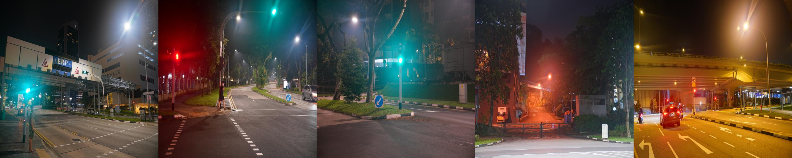
</p>

2. [LED data](https://www.dropbox.com/sh/7lhpnj2onb8c3dl/AAC-UF1fvJLxvCG-IuYLQ8T4a?dl=0) <br>
We captured images with dimmer light as the reference images.
<p align="left">
  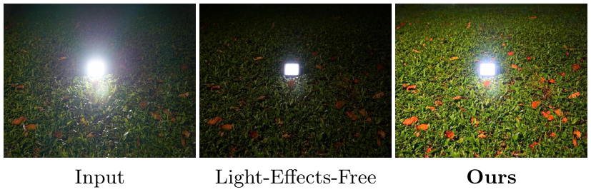
</p>

3. [GTA5 nighttime fog](https://www.dropbox.com/sh/gfw44ttcu5czrbg/AACr2GZWvAdwYPV0wgs7s00xa?dl=0) <br>
Synthetic GTA5 nighttime fog data.<br> 
* `ECCV2020`
*Nighttime Defogging Using High-Low Frequency Decomposition and Grayscale-Color Networks* [[Paper]](https://www.ecva.net/papers/eccv_2020/papers_ECCV/papers/123570460.pdf)\
Wending Yan, [Robby T. Tan](https://tanrobby.github.io/pub.html) and [Dengxin Dai](https://vas.mpi-inf.mpg.de/) 

<p align="left">
  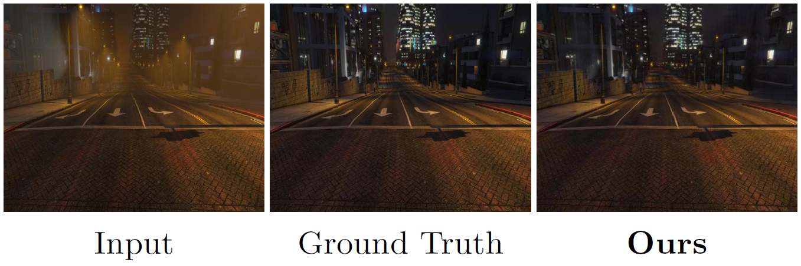
</p>

4. [Syn-light-effects](https://www.dropbox.com/sh/2sb9na4ur7ry2gf/AAB1-DNxy4Hq6qPU-afYIKVaa?dl=0) <br>
Synthetic-light-effects data is the implementation of the paper:<br>
* `ICCV2017`
*A New Convolution Kernel for Atmospheric Point Spread Function Applied to Computer Vision* [[Paper]](https://ieeexplore.ieee.org/document/4408899)\
Run the [Matlab code](https://github.com/jinyeying/night-enhancement/blob/main/glow_rendering_code/repro_ICCV2007_Fig5.m) to generate Syn-light-effects:
```
glow_rendering_code/repro_ICCV2007_Fig5.m
```
<p align="left">
  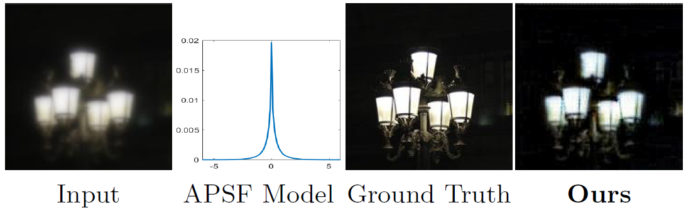
</p>

# Light-Effects Suppression Results:
## Pre-trained Model
[Update] We released the [light-effects suppression code](https://github.com/jinyeying/night-enhancement/blob/main/main_delighteffects.py) and [checkpoint](https://www.dropbox.com/s/9fif8itsu06quvn/delighteffects_params_0600000.pt?dl=0) on May 21, 2023. 
1. Download the [pre-trained de-light-effects model](https://www.dropbox.com/s/9fif8itsu06quvn/delighteffects_params_0600000.pt?dl=0), put in `./results/delighteffects/model/`
2. Put the [test images](https://github.com/jinyeying/night-enhancement/tree/main/light-effects) in `./light-effects/`

## Light-effects Suppression Test
```
python main_delighteffects.py
```

## Demo
[Update] We released [demo_all.html](https://github.com/jinyeying/night-enhancement/blob/main/demo_all.html) and [demo_all.ipynb code](https://github.com/jinyeying/night-enhancement/blob/main/demo_all.ipynb) on May 21, 2023. 

[Inputs](https://github.com/jinyeying/night-enhancement/tree/main/light-effects) are in `./light-effects/`, [Outputs](https://github.com/jinyeying/night-enhancement/tree/main/light-effects-output) are in `./light-effects-output/`
```
demo_all.ipynb
```
<p align="left">
  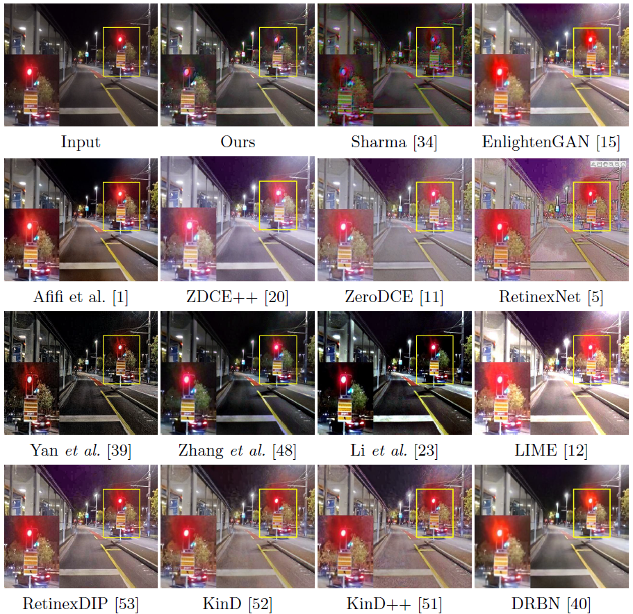
</p>

[Update] We released the [demo.py code](https://github.com/jinyeying/night-enhancement/blob/main/demo.py) on Dec 28, 2022.
```
python demo.py
```

## Decomposition
[Update] We released the [decomposition code](https://github.com/jinyeying/night-enhancement/blob/main/decomposition_code/demo_decomposition.m) on Dec 28, 2022. <br>
Run the code to decomposition layers, output [light-effects layers](https://www.dropbox.com/sh/d7myjujl9gwotkz/AAA0iSsO1FbWqNkbB6QR-sLCa?dl=0), and [initial background layers](https://www.dropbox.com/sh/bis4350df85gz0e/AAC7wY92U9K5JW3aSaD0mvcya?dl=0).    
```
demo_decomposition.m
```
[Background Results](https://www.dropbox.com/sh/bis4350df85gz0e/AAC7wY92U9K5JW3aSaD0mvcya?dl=0) | 
[Light-Effects Results](https://www.dropbox.com/sh/d7myjujl9gwotkz/AAA0iSsO1FbWqNkbB6QR-sLCa?dl=0) |
[Shading Results](https://www.dropbox.com/sh/venya8tvetyiv07/AABud1xlWGVquKptBsIZ0jxpa?dl=0)

<p align="left">
  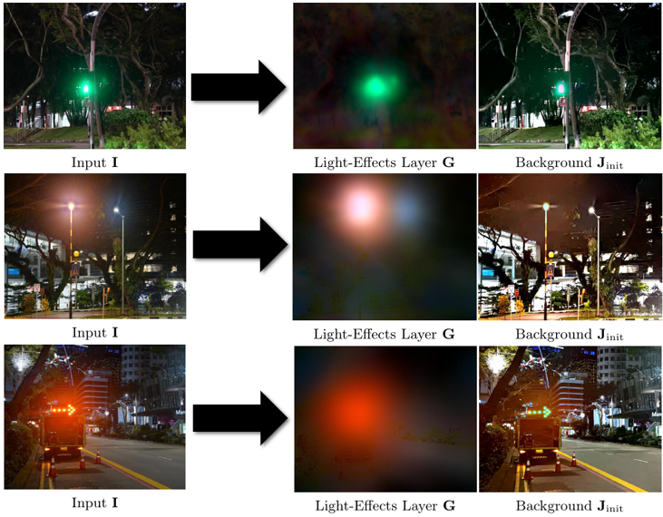
</p>

### Feature Results:
1. Run the [MATLAB code](https://github.com/jinyeying/night-enhancement/blob/main/VGG_code/checkGrayMerge.m) to adaptively fuse the three color channels, and output `I_gray`.
```
checkGrayMerge.m
```
<p align="left">
  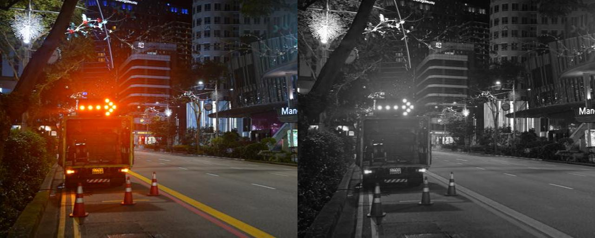
</p>

2. Download the [fine-tuned VGG model](https://www.dropbox.com/s/xzzoruz1i6m7mm0/model_best.tar?dl=0) (fine-tuned on [ExDark](https://github.com/cs-chan/Exclusively-Dark-Image-Dataset)), put in `./VGG_code/ckpts/vgg16_featureextractFalse_ExDark/nets/model_best.tar`

3. Obtain structure features.
```
python test_VGGfeatures.py
```

## Summary of Comparisons:
<p align="left">
  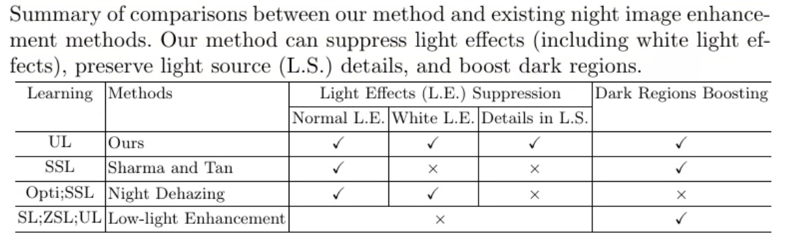
</p>


### Low-Light Enhancement
1. [LOL dataset](https://daooshee.github.io/BMVC2018website/) <br>
LOL: Chen Wei, Wenjing Wang, Wenhan Yang, and Jiaying Liu. "Deep Retinex Decomposition for Low-Light Enhancement", BMVC, 2018. [[Baiduyun (extracted code: sdd0)]](https://pan.baidu.com/s/1spt0kYU3OqsQSND-be4UaA) [[Google Drive]](https://drive.google.com/file/d/18bs_mAREhLipaM2qvhxs7u7ff2VSHet2/view?usp=sharing) <br>

2. [LOL-Real dataset](https://github.com/flyywh/CVPR-2020-Semi-Low-Light/) <br>
LOL-real (the extension work): Wenhan Yang, Haofeng Huang, Wenjing Wang, Shiqi Wang, and Jiaying Liu. "Sparse Gradient Regularized Deep Retinex Network for Robust Low-Light Image Enhancement", TIP, 2021. [[Baiduyun (extracted code: l9xm)]](https://pan.baidu.com/s/1U9ePTfeLlnEbr5dtI1tm5g) [[Google Drive]](https://drive.google.com/file/d/1dzuLCk9_gE2bFF222n3-7GVUlSVHpMYC/view?usp=sharing) <br> <br>
We use LOL-real as it is larger and more diverse.


# Low-Light Enhancement Results:
## Pre-trained Model

1. Download the [pre-trained LOL model](https://www.dropbox.com/s/0ykpsm1d48f74ao/LOL_params_0900000.pt?dl=0), put in `./results/LOL/model/`
2. Put the test images in `./LOL/` 

## Low-light Enhancement Test 

🔥[](https://replicate.com/cjwbw/night-enhancement)🔥 Online test: https://replicate.com/cjwbw/night-enhancement
<p align="left">
  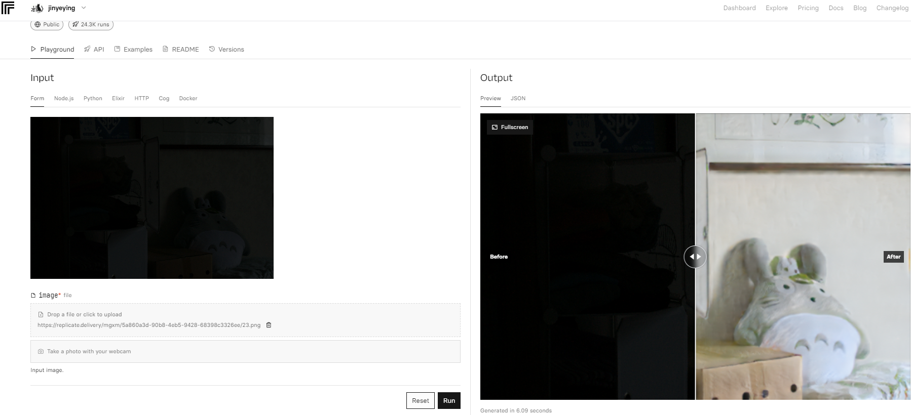
</p>

```
python main.py
```

## Results
<p align="left">
  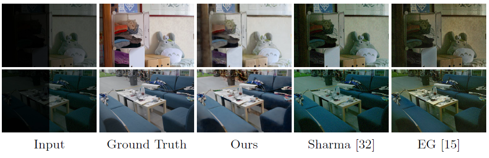
</p>

1. [LOL-Real Results](https://www.dropbox.com/sh/t6eb4aq025ctnhy/AADRRJNN3u-N8HApe1tFo19Ra?dl=0)<br>

Get the following Table 4 in the main paper on the LOL-Real dataset (100 test images).

|Learning| Method | PSNR | SSIM | 
|--------|--------|------|------ |
| Unsupervised Learning| **Ours** | **25.51** |**0.8015**|
| N/A | Input | 9.72 | 0.1752|

<p align="left">
  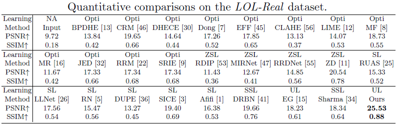
</p>

[Update]: Re-train (train from scratch) in LOL_V2_real (698 train images）, and test on [LOL_V2_real](https://www.dropbox.com/sh/7t1qgl4anlqcvle/AAAyOUHMoG5IkzCX5GQDPd1Oa?dl=0) (100 test images).<br>
PSNR: 20.85 (vs EnlightenGAN's 18.23), SSIM: 0.7243 (vs EnlightenGAN's 0.61)
[pre-trained LOL_V2 model](https://www.dropbox.com/sh/7t1qgl4anlqcvle/AAAyOUHMoG5IkzCX5GQDPd1Oa?dl=0)

2. [LOL-test Results](https://www.dropbox.com/sh/la21ocjk14dtg9t/AABOBsCQ39Oml33fItqX5koFa?dl=0)<br>

Get the following Table 3 in the main paper on the LOL-test dataset (15 test images).
|Learning| Method | PSNR | SSIM | 
|--------|--------|------|------ |
| Unsupervised Learning| **Ours** | **21.521** |**0.7647**|
| N/A | Input | 7.773 | 0.1259|

<p align="left">
  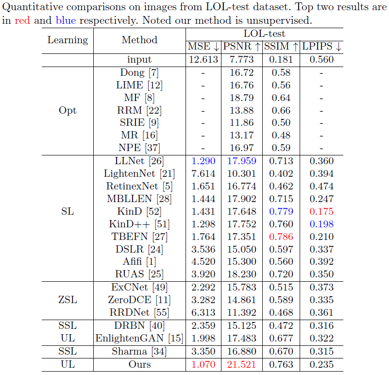
</p>

## License
The code and models in this repository are licensed under the MIT License for academic and other non-commercial uses.<br>
For commercial use of the code and models, separate commercial licensing is available. Please contact:
- Yeying Jin (jinyeying@u.nus.edu)
- Robby T. Tan (tanrobby@gmail.com)
- Jonathan Tan (jonathan_tano@nus.edu.sg)

### Citations
If this work is useful for your research, please cite our paper. 
```BibTeX
@inproceedings{jin2022unsupervised,
  title={Unsupervised night image enhancement: When layer decomposition meets light-effects suppression},
  author={Jin, Yeying and Yang, Wenhan and Tan, Robby T},
  booktitle={European Conference on Computer Vision},
  pages={404--421},
  year={2022},
  organization={Springer}
}

@inproceedings{jin2023enhancing,
  title={Enhancing visibility in nighttime haze images using guided apsf and gradient adaptive convolution},
  author={Jin, Yeying and Lin, Beibei and Yan, Wending and Yuan, Yuan and Ye, Wei and Tan, Robby T},
  booktitle={Proceedings of the 31st ACM International Conference on Multimedia},
  pages={2446--2457},
  year={2023}
}
```
If light-effects data is useful for your research, please cite the paper. 
```BibTeX
@inproceedings{sharma2021nighttime,
	title={Nighttime Visibility Enhancement by Increasing the Dynamic Range and Suppression of Light Effects},
	author={Sharma, Aashish and Tan, Robby T},
	booktitle={Proceedings of the IEEE/CVF Conference on Computer Vision and Pattern Recognition},
	pages={11977--11986},
	year={2021}
}
```
